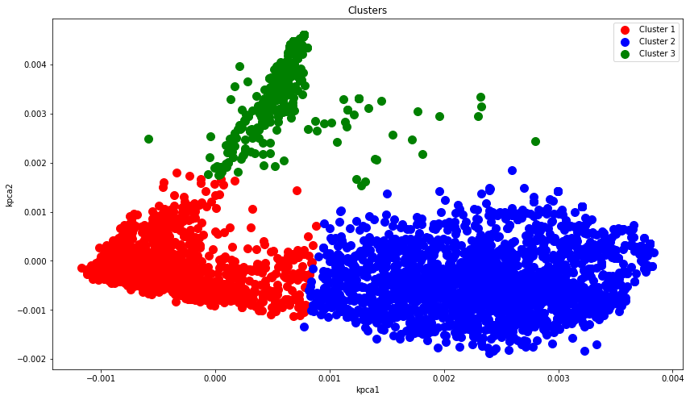

# Text Clustering on News Dataset
In this notebook we use NLP methods and kernel PCA to build a clustering model

[Dataset on kaggle](https://www.kaggle.com/datasets/narendrageek/reuters21578-multilabel-classification-news)

## Contents
### Data Cleaning
* Column selection
* Null values
* Duplicate values

### Data Preprocessing
* Lowercasing and removing newline, tabular spaces, numbers and punctuations
* Stopwords removal
* Lemmatization
* Label encoding
* TF-IDF vectorization

### Kernel PCA
In this part we apply kernel PCA to reduce dimensions

### K-Means Clustering
At first, we apply the elbow method to calculate the best K and then build a model

### Silhouette Score
The score for this task is 0.81

### Visualization

We finish the task with final analyses 
